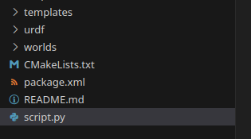

# dae2world 
 Be able to convert your dae models into a working gazebo .world file with this script

## Setup

It is highly recommended for this to be run on a linux machine, as it's built for it.

All you need to do is either, bring your dae file relative to this repo, or bring the templates folder and the script.py file into your project for easy use.

Figure above is me dragging them to the root folder of a ROS2/Gazebo classic project

Also this script uses jinja2, so just run the following command where the script is:

`pip install jinja2`

## How to run

This script uses special args flags for it to work properly, they are:

- -df (the relative file path to the dae file of your choosing, **required**)
- -n (model name, will be used as the world file name as well, **required**)
- -t (tell which gazebo type you're using, its defaulted to gazebo classic but you can use it for sim with gz, ex: -t gz, **optional**)

Such an example command to run it is

Gazebo Classic:
`python script.py -df example.dae -n example123`

Gazebo Sim:
`python script.py -df example.dae -n example123 -t gz`

After running that, a worlds directory will be created in which the world file will reside in, and you can just do a simple gazebo command

Gazebo Classic: 
`gazebo worlds/example123.world`

Gazebo Sim: `gz sim example123.world`

